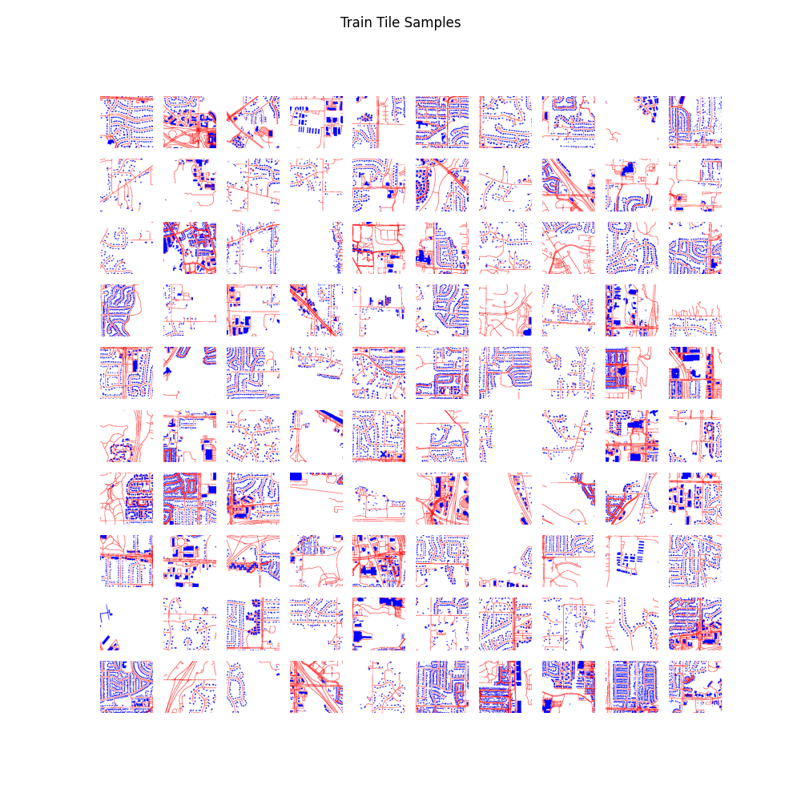

# City Diffusion Model


## Using pretrained model

```
uv run api.py --port 6620 --model bart1259/CityDiffusion
```

Navigate to `http://localhost:6620` for the web interface. Pulls the model from [HuggingFace](https://huggingface.co/bart1259/CityDiffusion).

## Training your own model

```
uv sync
uv run jupyter nbconvert --to script ./GenTrainData.ipynb
uv run jupyter nbconvert --to script ./TrainDiffusion.ipynb
sbatch -G 1 --time=72:00:00 -J GenData gen_data.sh .hyperparameters
sbatch -G 1 --time=72:00:00 -J TrainDiff train_diffusion.sh .hyperparameters
```

Serve the model:
```
uv run api.py --port 6620 --model ./runs/run0/out/city_diffusion_ddpm_5000
```

Navigate to `http://localhost:6620` to test the model with the web interface.

## Reproducibility

The results are difficult to reproduce as low loss doesn't always mean visually appealing results. Many models are trained and only some (~40%) produce decent results. Evenutally it would be cool to either make a better metric or label preferences and use RL to guide the model training.

## Training Data



## Post Processing

The outputs from the diffusion model can be kind of eh (dull, color skewed, noisy, etc). We know the three colors that we expect to see red, blue, and white (road, building, and empty space). We use KMeans clustering to force the output to only have these three colors which cleans up the images a lot.